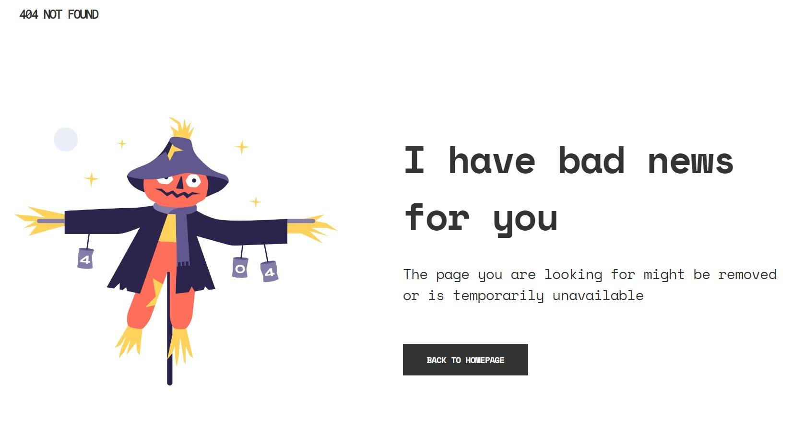

<h1 align="center">{404 not found}</h1>

   Solution for a challenge from  <a href="http://devchallenges.io" target="_blank">Devchallenges.io</a>.

  <h3>
    <a href="https://dev-challenges-404-not-found.netlify.app/">
      Demo
    </a>
     | 
    <a href="https://github.com/ZonaGuillermo/devChallenges-Responsive--404-not-foud">
      Solution
    </a>
     | 
    <a href="https://devchallenges.io/challenges/wBunSb7FPrIepJZAg0sY">
      Challenge
    </a>
  </h3>

 

<!-- TABLE OF CONTENTS -->

## Table of Contents

- [Overview](#overview)
  - [Built With](#built-with)
- [Features](#features)
- [Contact](#contact)
- [Acknowledgements](#acknowledgements)

 

<!-- OVERVIEW -->

## Overview

Hello everyone!! 😊

This is the first challenge about Responsive Web Developer path in [devchallenges.io](https://devchallenges.io/). It consist to create a 404 error page following a given design in Figma.

In this case I have the opportunity to investigate about CSS Grid Layout and fluid design. I think fluid design is a better practice than media queries as whith a fluid design we have a lower maintenance and it adapts to all new screens today or in the future.

I have used functions like [clamp()](https://developer.mozilla.org/en-US/docs/Web/CSS/clamp), [min()](https://developer.mozilla.org/en-US/docs/Web/CSS/min) and [max()](https://developer.mozilla.org/en-US/docs/Web/CSS/max) and also [custom properties](https://developer.mozilla.org/en-US/docs/Web/CSS/--*) and [CSS Grid Layout](https://developer.mozilla.org/es/docs/Web/CSS/CSS_Grid_Layout).

In addition, I discover a new [web tool](https://min-max-calculator.9elements.com/) that makes coding with `clamp()` more efficient

 

### Built With

This time I have used HTML and CSS only.

 

## Features

This application/site was created as a submission to a [DevChallenges](https://devchallenges.io/challenges) challenge. The [challenge](https://devchallenges.io/challenges/wBunSb7FPrIepJZAg0sY) was to build an application to complete the given user stories.

 

## Acknowledgements

<!-- This section should list any articles or add-ons/plugins that helps you to complete the project. This is optional but it will help you in the future. For exmpale -->

- [MDN clamp()](https://developer.mozilla.org/en-US/docs/Web/CSS/clamp)
- [MDN min()](https://developer.mozilla.org/en-US/docs/Web/CSS/min)
- [MDN max()](https://developer.mozilla.org/en-US/docs/Web/CSS/max)
- [MDN Custom Properties](https://developer.mozilla.org/en-US/docs/Web/CSS/--*)
- [MDN CSS Grid Layout](https://developer.mozilla.org/es/docs/Web/CSS/CSS_Grid_Layout)
- [clamp() Calculator](https://min-max-calculator.9elements.com/)

 

## Contact

- Website [zonaguillermo.com](https://zonaguillermo.com)
- GitHub [@yZonaGuillermo](https://github.com/ZonaGuillermo)
- Twitter [@yZonaGuillermo6](https://twitter.com/ZonaGuillermo6)
